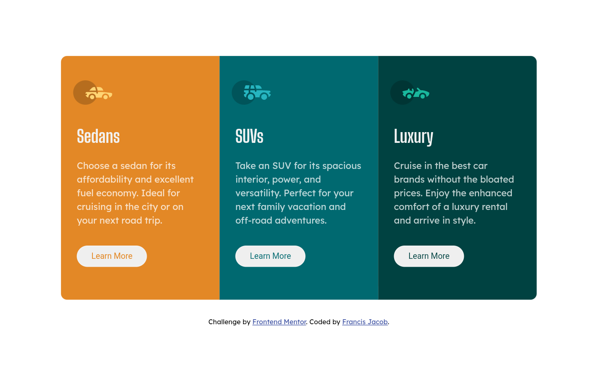
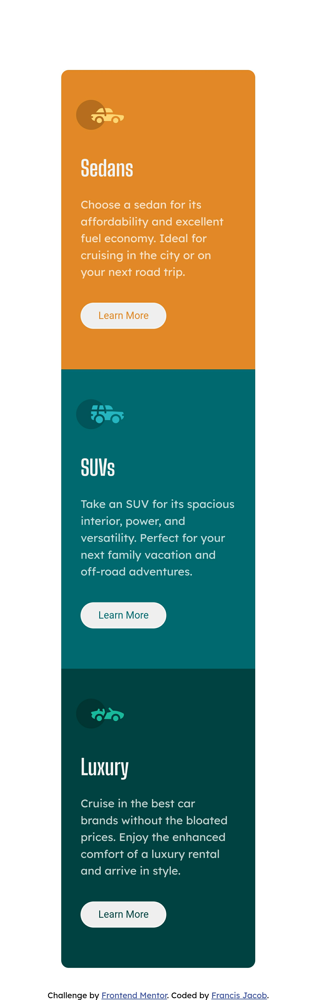

# Frontend Mentor - 3-column preview card component solution

This is a solution to the [3-column preview card component challenge on Frontend Mentor](https://www.frontendmentor.io/challenges/3column-preview-card-component-pH92eAR2-). Frontend Mentor challenges help you improve your coding skills by building realistic projects. 

## Table of contents

- [Overview](#overview)
  - [The challenge](#the-challenge)
  - [Screenshot](#screenshot)
  - [Links](#links)
- [My process](#my-process)
  - [Built with](#built-with)
  - [What I learned](#what-i-learned)
  - [Continued development](#continued-development)
  - [Useful resources](#useful-resources)
- [Author](#author)


## Overview

### The challenge

Users should be able to:

- View the optimal layout depending on their device's screen size
- See hover states for interactive elements

### Screenshot





### Links

- Solution URL: [Add solution URL here](https://your-solution-url.com)
- Live Site URL: [Add live site URL here](https://your-live-site-url.com)

## My process

### Built with

- Semantic HTML5 markup
- CSS custom properties
- Flexbox
- Media Query
- Responsive web design 


### What I learned

I learnt how to use media queries to modify specific characteristics depending on the device's viewport. An example is shown below 

first design for desktop:

```.sedans{
    background-color:hsl(31, 77%, 52%);
    flex-basis:260px;
    height:400px; 
    border-radius:10px 0px 0px 10px ;   
}
```

applying media query for mobile:

```css
    @media(max-width:435px){
    .sedans{
        border-radius: 10px 10px 0px 0px;
    }
}
```

### Continued development

My focus now will be on learning the concept of mobile first workflow and Tailwind.

### Useful resources

- [Responsive web design with media queries](https://www.w3schools.com/css/css_rwd_mediaqueries.asp) - This is an amazing article which helped me understand Responsive Web design and Media queries. I'd recommend it to anyone still learning this concept.

- [Google fonts](https://fonts.google.com/) - This helped me to implement fonts on the website, so no trouble with font embedding.


## Author

- Website - [ Francis Jacob](https://github.com/Jacbfrancis)
- Frontend Mentor - [@yourusername](https://www.frontendmentor.io/profile/Jacbfrancis)
- Twitter - [@jacobxavier_](https://twitter.com/jacobxavier_?t=YdJHQngdQYJVbC7mWspqDg&s=08)

